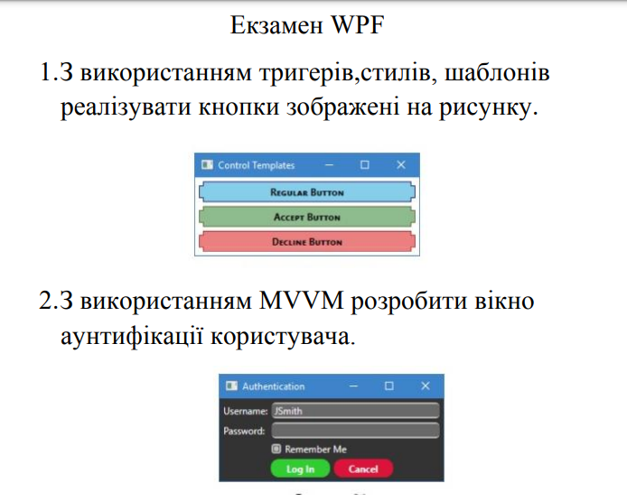

# LoginMVVM
WPF C#

  

3.Необхідно розробити додаток, який дозволяє
налаштовувати колір в системі ARGB та
добавляти в список кольорів. Також в додатку
є можливість проглянути список всіх доданих
кольорів. Реалізувати можливість видалення
кольору зі списку

